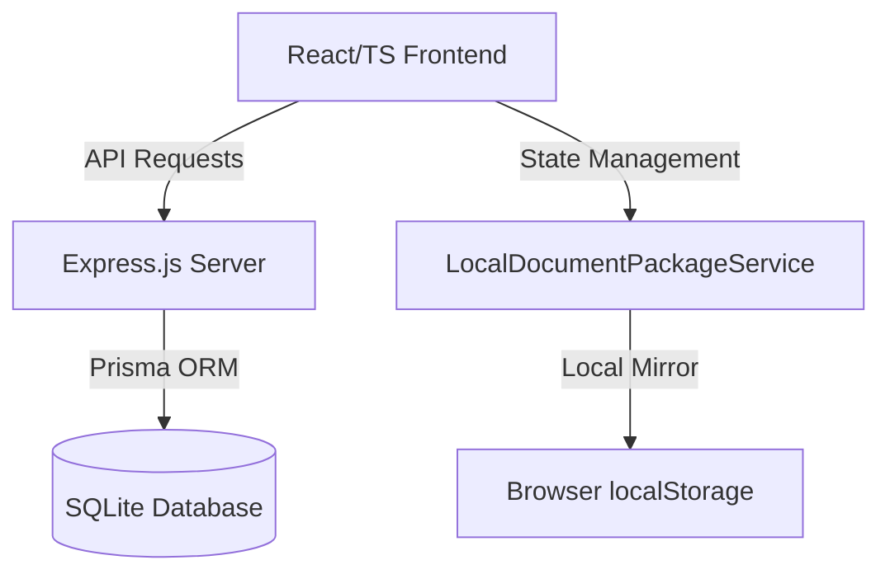

# ExportMate Local Knowledge Base & Playbook

Chào mừng các Codex Agents! Tài liệu này lưu trữ toàn bộ tri thức cốt lõi, kiến trúc hệ thống, quy chuẩn thiết kế UI/UX, thông tin môi trường local và hướng dẫn phát triển của dự án **ExportMate** để duy trì tính nhất quán qua mọi phiên chat.

---

## 1. Môi Trường Local & Cấu Thiết Lập Secrets (Local Env & Host Mapping)

Dự án sử dụng tệp cấu hình bí mật cục bộ tại đường dẫn vật lý: `D:\code\user.env`. Các tài nguyên hiện có bao gồm:

### ➜ Cổng Kết Nối Local (Host Ports)
* **React Frontend (Vite)**: `http://localhost:5174/` (nếu cổng `5173` bị chiếm dụng, Vite tự động chuyển sang `5174`)
* **Express Backend (Node.js)**: `http://localhost:4000/`

### ➜ Khóa API & Kết Nối Dịch Vụ
* **9Router Gateway (AI Models)**: `http://localhost:20128` (Remote: `https://9router.phamphunguyenhung.com/v1`)
* **Gemini API Key**: `<YOUR_GEMINI_API_KEY>`
* **Dokploy (CI/CD Dashboard)**: `https://dp.sgp1.w9.nu`
* **Plesk Web Hosting (fanpageai.com)**: `https://103.28.36.163:8443` (IP: `103.28.36.163`, User: `nhfantso`)
* **Bybit Trading API**: Cấu hình sàn giao dịch tự động kết nối qua Bybit SDK.
* **Cloudflare Deployment**:
  * **Cloudflare Workers**: Deploy backend API lên Cloudflare Serverless Workers.
  * **Cloudflare D1**: Cơ sở dữ liệu SQLite Serverless.
  * **Cloudflare R2**: Lưu trữ tệp tin (Object Storage).

---

## 2. Kiến Trúc Hệ Thống (Architecture & Tech Stack)

ExportMate được xây dựng dưới dạng **Monorepo** tích hợp cao:



* **Frontend**: React SPA, TypeScript, TailwindCSS (TailAdmin template).
* **Backend**: Node.js, Express, Prisma ORM.
* **Database**: SQLite cục bộ (`server/prisma/dev.db`) để dễ dàng di động và đảm bảo hiệu năng.
* **AI Multi-Agent System**:
  * Các Agent chuyên biệt (**Helen - Sales**, **Marcus - Legal**, **Thomas - Logistics**) xử lý nghiệp vụ thông qua Gemini API.
  * Tích hợp cơ chế chấm điểm tuân thủ (Compliance Scoring Matrix) dựa trên 14 quy tắc rà soát đối chiếu chéo tự động.

---

## 3. Quy Chuẩn Giao Diện Premium Drawer / Modal (Premium Overlay Design Pattern)

Để tránh các lỗi chồng chéo layout, rò rỉ cuộn nền, hoặc đè nút hành động ở chân trang, mọi Drawer/Modal phải tuân thủ nghiêm ngặt cấu trúc sau:

### Quy tắc Layout 3 vùng Flexbox (`flex flex-col h-dvh`)
```tsx
{isOpen && (
  <div role="dialog" aria-modal="true" className="fixed inset-0 z-[100] overflow-hidden">
    {/* 1. Backdrop làm mờ toàn màn hình (Z-index 99) */}
    <div 
      onClick={onClose} 
      className="absolute inset-0 bg-slate-950/40 backdrop-blur-sm z-[99] transition-opacity" 
    />

    {/* 2. Drawer Panel chính ngăn click lan truyền (Z-index 100) */}
    <aside 
      onClick={(e) => e.stopPropagation()} 
      className="absolute right-0 top-0 h-dvh w-full sm:max-w-[520px] bg-white dark:bg-boxdark shadow-2xl flex flex-col z-[100]"
    >
      {/* 2.1 Header: shrink-0 (luôn cố định ở đỉnh) */}
      <header className="shrink-0 border-b border-stroke p-6">
        {/* Tiêu đề & Nút đóng */}
      </header>

      {/* 2.2 Body: min-h-0 flex-1 overflow-y-auto (cuộn độc lập) */}
      <main className="min-h-0 flex-1 overflow-y-auto p-6 space-y-6">
        {/* Nội dung chi tiết */}
      </main>

      {/* 2.3 Footer: shrink-0 border-t (luôn cố định ở đáy) */}
      <footer className="shrink-0 border-t border-stroke p-6 pb-[calc(1.5rem+env(safe-area-inset-bottom))]">
        {/* Nút hành động (Đóng, Duyệt, Tạo) */}
      </footer>
    </aside>
  </div>
)}
```

### 💡 Các Chi Tiết Tương Tác Quan Trọng:
* **Khóa Scroll Nền**: Luôn thêm hook khóa cuộn của body khi mount và khôi phục khi unmount:
  ```tsx
  useEffect(() => {
    if (!isOpen) return;
    const original = window.document.body.style.overflow;
    window.document.body.style.overflow = "hidden";
    return () => { window.document.body.style.overflow = original; };
  }, [isOpen]);
  ```
* **Đóng Bằng Phím ESC**: Luôn listen sự kiện `keydown` để đóng modal khi ấn nút Escape.
* **Ngăn chặn click bong bóng (`stopPropagation`)**: Thẻ panel con phải có `onClick={(e) => e.stopPropagation()}` để không bị đóng ngoài ý muốn khi click vào nội dung bên trong.

---

## 4. Chỉ Dẫn Chạy Terminal Trên Windows (Windows PowerShell Exec Rules)

Khi tương tác với môi trường hệ điều hành Windows qua shell PowerShell, các agents **bắt buộc** phải tuân thủ quy tắc sau để tránh lỗi cú pháp lặp lại:

* **Không sử dụng toán tử `&&` để nối lệnh**: Windows PowerShell phiên bản cũ (mặc định trên Windows 10/11 là PowerShell 5.1) không nhận diện `&&` làm phân tách câu lệnh và sẽ trả về lỗi `ParserError`.
* **Giải pháp**:
  * Tách các lệnh thành nhiều tool call độc lập (Ưu tiên số 1).
  * Hoặc sử dụng dấu chấm phẩy `;` làm phân tách câu lệnh (VD: `git add file.tsx ; git commit -m "message"`).

---

## 5. Danh Sách Các Files Quy Chuẩn (Reference Implementation)

Nếu cần tham khảo cách triển khai Drawer/Modal chuẩn hóa đã được kiểm chứng hoạt động thực tế trên production, hãy xem các file sau:
* **Chi tiết chứng từ**: [DocumentDetailDrawer.tsx](file:///d:/code/exportmate/src/features/document-package/components/DocumentDetailDrawer.tsx)
* **Khung Workspace AI**: [ChecklistExportKit.tsx](file:///d:/code/exportmate/src/components/ExportMate/ChecklistExportKit.tsx)
* **Ủy thác Agentic**: [CostMapPage.tsx](file:///d:/code/exportmate/src/pages/CostMap/CostMapPage.tsx)
* **Báo cáo ESG Hộ Chiếu**: [ShipmentPassportPage.tsx](file:///d:/code/exportmate/src/pages/ShipmentPassport/ShipmentPassportPage.tsx)
* **Ví thanh toán VietQR**: [WalletPage.tsx](file:///d:/code/exportmate/src/pages/Wallet/WalletPage.tsx)

---

## 6. Giao Thức Tự Học Của Antigravity (Antigravity Self-Learning Protocol)

Hệ thống AI Agent trên ExportMate chính thức áp dụng giao thức tự học dài hạn để tích lũy tri thức cục bộ. Giao thức này sử dụng kiến trúc bộ nhớ động **Markdown-Native Local Memory** để theo dõi lỗi, lưu vết các quyết định thiết kế và quy trình vận hành.

*   **Tài liệu hướng dẫn chi tiết**: Hướng dẫn đầy đủ về 7 mô hình tự học và quy trình kiểm thử 3 vòng được lưu tại [SELF_LEARNING.md](file:///d:/code/exportmate/.agents/SELF_LEARNING.md).
*   **7 Mô Hình Học Tập (7 Self-Learning Models)**:
    1.  **TIL (Today I Learned)**: Ghi nhận bài học, thủ thuật mới sau mỗi tác vụ thành công.
    2.  **ADR (Architecture Decision Records)**: Nhật ký ghi lại các quyết định thiết kế kiến trúc tránh flip-flop.
    3.  **Operational Runbooks**: Kịch bản chạy lệnh, deploy chuẩn hóa từng bước.
    4.  **RCA (Root Cause Analysis)**: Phân tích nguyên nhân gốc rễ và tự động suy ra các quy tắc phát triển mới từ bug đã fix.
    5.  **Performance Optimization**: Nhật ký tối ưu hóa hiệu suất kèm số liệu đo lường.
    6.  **Code Smell Catalog**: Danh mục các pattern code xấu cần chủ động thanh lý.
    7.  **Effective Prompt Patterns**: Các mẫu prompt tối ưu giúp AI sinh code chuẩn xác.
*   **Nguyên tắc cam kết**: Mỗi khi phát hiện lỗi UI/UX hoặc terminal lặp lại trên Windows, AI Agent phải lập tức audit và ghi lại cách khắc phục trực tiếp vào [.agents/skills/exportmate-ux-patterns/SKILL.md](file:///d:/code/exportmate/.agents/skills/exportmate-ux-patterns/SKILL.md) và [KNOWLEDGE_BASE.md](file:///d:/code/exportmate/.agents/KNOWLEDGE_BASE.md).

---

## 7. Quy Trình Kiểm Tra & Bắt Lỗi CI/CD Deploy Cloudflare

Mọi commit & push code lên Git phải tuân thủ kịch bản kiểm định 4 bước và sử dụng kịch bản xử lý sự cố tại [.agents/learnings/2026-07-22-cloudflare-ci-cd-build-and-deploy-troubleshooting.md](file:///d:/03-Startups-Products/01-Active-Startups/exportmate-new/.agents/learnings/2026-07-22-cloudflare-ci-cd-build-and-deploy-troubleshooting.md):

1. **Khóa Peer Dependency**: `.npmrc` chứa `legacy-peer-deps=true` ngăn lỗi `ERESOLVE` khi dùng TypeScript 7.0.2.
2. **Kiểm tra local trước khi push**: `npm run typecheck && npm run build`.
3. **Đồng bộ Database D1 Remote**: `npx wrangler d1 migrations apply exportmate-db --remote`.
4. **Deploy & Tail Logs**: `npx wrangler deploy` và kiểm tra endpoint `https://exportmate.ppnh10092002.workers.dev/api/health`.

---

## 8. LocalMate Consultation Module v1 & Notion Integration Strategy

### ➜ Thông Tin Tích Hợp Notion Database
* **Notion Database ID**: `3a8c661d-848a-80d2-9db4-e34bdf2336d9` (Database: `Localmate VN`)
* **Environment Variable File**: `D:\code\user.env` (`NOTION_API_KEY`, `NOTION_PAGE_URL`)
* **Notion Native Date Range Formatting**: Để hiển thị chuẩn đồ thị Gantt/Timeline trên Notion, thuộc tính Date phải sử dụng định dạng dải thời gian: `{ date: { start: "YYYY-MM-DD", end: "YYYY-MM-DD" } }`.

### ➜ Lời Hứa Bán Hàng Duy Nhất (Core Sales Promise)
> *"LocalMate giúp doanh nghiệp mới có hiện diện số rõ ràng, dễ được tin và dễ nhận khách trong 7 ngày."*

### ➜ Mô Hình Lương 3P (Revenue Split cho Deal 2.900.000đ)
* **P1 — Position & Infrastructure (Hưng bao trọn 100%)**: Hưng lo toàn bộ chi phí cứng (Domain .com/.vn, Hosting server, Tool, Proxy và hỗ trợ tài chính khẩn cấp khi Tố Anh cần).
* **P2 — Person & Assets**: Tích lũy công sức đóng góp Script, Playbook, Checklist 7 chạm vào giá trị cổ phần & vai trò quản lý dài hạn (Review 08/08).
* **P3 — Performance (Hoa hồng chốt deal 2.9M)**:
  * **Deal 1 – Deal 4**: Tố Anh nhận ngay **1.200.000đ / deal** chốt thành công.
  * **Deal 5+ trở đi trong tháng**: Thưởng lũy tiến nâng lên **1.400.000đ / deal** cho Tố Anh.
  * Hưng nhận phần còn lại (~1.500.000đ) để trang trải hạ tầng, làm web mobile, biên tập **10 bài viết dịch vụ** và bảo trì 12 tháng.

### ➜ Chiến Lược 7 Lần Chạm Chân Thành (7-Touches Sales Pipeline)
1. **Touch 1 (Tương tác thật)**: Khen ngợi & góp ý chân thành bài viết/Maps tiệm họ.
2. **Touch 2 (Trao Live Demo)**: Gửi link Live Demo mượt đúng tên tiệm khách (dựng trong 15p).
3. **Touch 3 (Tặng mẹo free)**: Tặng 1 mẹo tối ưu vị trí Google Maps miễn phí.
4. **Touch 4 (Case study mẫu)**: Gửi video short / voice note 30s tiệm cùng ngành đã làm đẹp.
5. **Touch 5 (Zalo Voice Call)**: Hỏi thăm cảm nhận, trao đổi nhu cầu kinh doanh thật.
6. **Touch 6 (Offer Zero-Risk 2.9M)**: Cam kết bao gồm 10 bài viết + Khấu trừ rủi ro (Nghiệm thu mượt mới thanh toán).
7. **Touch 7 (Chốt hợp đồng)**: Thu 5 món Brief, bàn giao trong 48h & quyết toán hoa hồng P3 cho Tố Anh.
