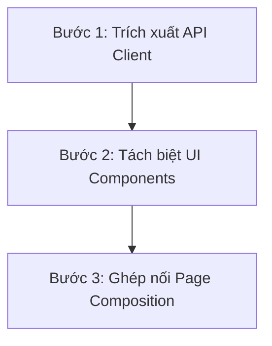

# 📘 Cẩm nang Tái cấu trúc React SPA 4 Tầng cho ExportMate (SPA Refactoring Guide)

Tài liệu này đúc kết phương pháp và cách làm chuẩn đã được áp dụng để tái cấu trúc thành công 7 trang cốt lõi của ExportMate sang mô hình SPA 4 tầng sạch sẽ, kế thừa cao và loại bỏ hoàn toàn code lặp.

---

## 1. Quy trình Phân rã 3 Bước (The 3-Step Refactor Flow)

Khi phát triển trang mới hoặc refactor trang cũ, bắt buộc thực hiện theo đúng 3 bước sau:



### Bước 1: Trích xuất API Client (`api/*.api.ts`)
*   Tuyệt đối không gọi `axios` hoặc `fetch` trực tiếp trong component.
*   Tạo file api tập trung sử dụng `apiClient` từ `src/services/api-client` để tự động tiêm JWT Token:
    ```typescript
    import apiClient from "../../../services/api-client";
    export const featureApi = {
      list: () => apiClient.get("/api/feature"),
      create: (data) => apiClient.post("/api/feature", data),
    };
    ```

### Bước 2: Tách biệt UI Components (`components/`)
*   Tách biệt các phần UI phức tạp (Bảng danh sách, Form, Chart, KPIs) thành các component con độc lập trong thư mục `components/` của feature.
*   **Bảng danh sách:** Bắt buộc sử dụng generic component `DataTable` dùng chung để render, định nghĩa `ColumnDef<T>` riêng biệt.
*   **Biểu mẫu (Form):** Create (tạo mới) và Edit (sửa) bắt buộc sử dụng chung 1 component form, phân biệt bằng thuộc tính `mode: 'create' | 'edit'` và `defaultValues`.

### Bước 3: Ghép nối Page Composition (`pages/` hoặc Page chính)
*   Page chính đóng vai trò là điều phối viên (Conductor).
*   Chỉ gọi hook dữ liệu, quản lý đóng/mở Modals/Drawers và ráp các components con lại.
*   **Giới hạn dòng code:** Page chính tuyệt đối **không vượt quá 150 dòng JSX** (phần còn lại phải được component hóa).

---

## 2. Cách Sử dụng các Component dùng chung (Shared UI Elements)

### A. Bảng Generic `DataTable<T>`
```tsx
import DataTable, { ColumnDef } from "src/components/shared/DataTable";

const columns: ColumnDef<Buyer>[] = [
  {
    accessorKey: "name",
    header: "Nhà mua hàng",
    cell: ({ row }) => <span className="font-bold">{row.original.name}</span>,
  },
  {
    id: "status",
    header: "Trạng thái",
    cell: ({ row }) => <StatusBadge status={row.original.status} />,
  },
];

<DataTable<Buyer>
  data={buyers}
  columns={columns}
  isLoading={loading}
  emptyState={{
    title: "Chưa có nhà mua hàng",
    description: "Nhập thông tin nhà mua hàng để quản lý phễu RFQ.",
  }}
/>
```

### B. Nhãn Trạng thái `StatusBadge`
*   Component tự động chuẩn hóa key (chuyển sang chữ thường và thay khoảng trắng bằng dấu gạch dưới) để ánh xạ màu sắc Navy & Teal chuẩn xác:
```tsx
<StatusBadge status="ready" />        // Màu xanh Teal (Hoàn thành/Sẵn sàng)
<StatusBadge status="needs_review" /> // Màu vàng/cam (Đang chỉnh sửa)
<StatusBadge status="missing_docs" /> // Màu đỏ (Hết hạn/Thiếu tài liệu)
```

### C. Tiêu đề Trang `PageHeader`
*   Hỗ trợ hiển thị Breadcrumb tiếng Việt động, tự động ẩn breadcrumb cho các trang cấp 1 (khi danh sách breadcrumbs có chiều dài <= 1) để tránh thừa thãi:
```tsx
<PageHeader
  title="Hồ sơ xuất khẩu"
  description="Chuẩn hóa hồ sơ năng lực của doanh nghiệp."
  breadcrumbs={[
    { label: "Trang chủ", path: "/dashboard" },
    { label: "Hồ sơ xuất khẩu" }
  ]}
  actions={<button>Xuất tài liệu</button>}
/>
```

---

## 3. Quy chuẩn UI/UX và Phân vai State (DoD)
1.  **Light Mode & Màu sắc:** Sử dụng Navy (`#0B1F33`) định hình khung sidebar/header, Export Teal (`#00A889`) làm điểm nhấn, tuyệt đối **không dùng glassmorphism**.
2.  **Scrollbars B2B:** Tất cả thanh cuộn ngang/dọc của bảng và Kanban phải giới hạn chiều rộng tối đa 6px qua class `custom-scrollbar` hoặc `custom-scrollbar-thin`.
3.  **State Management:**
    *   *Server State:* Dùng TanStack Query hoặc API clients (cấm lưu dữ liệu backend trong Zustand).
    *   *UI State:* Dùng local state (useState) hoặc URL Search Params (cho bộ lọc, tabs, phân trang để khi reload không mất trạng thái).
