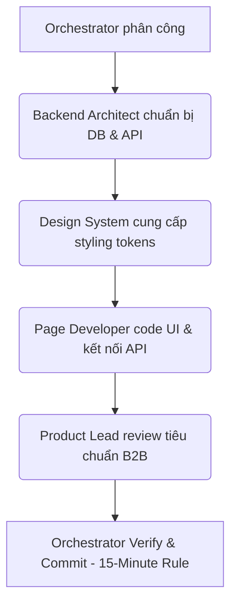

# 👥 Quy trình phối hợp đội ngũ Subagents (Teamwork Workflow)

Tài liệu này định nghĩa cách thức Orchestrator điều phối và phân công công việc cho 10 tiểu ban subagent chuyên trách để phát triển nhanh, chất lượng và tránh xung đột code.

---

## 1. Danh sách 10 Tiểu Ban (Subagent Roles)

1.  **Product & IA Lead (frontend_subagent):** Định hướng luồng trải nghiệm, routing (react-router v7), terminology, và ẩn/hiện các tab nghiệp vụ thương mại B2B.
2.  **Design System Lead (frontend_subagent):** Quản lý CSS tokens, Tailwind classes, bảng màu Navy & Teal (70-20-10), typography scale, co giãn scrollbar co giãn 6px, responsive breakpoints.
3.  **Page 1 (Overview) Dev (frontend_subagent):** Code trang Tổng quan (radar charts, KPI cards, stepper ngang, bảng việc cần làm).
4.  **Page 2 (Supplier Page) Dev (frontend_subagent):** Code trang Website & Supplier Page (laptop preview, toggle ngôn ngữ, status bars, phễu RFQ).
5.  **Page 3 (Export Profile) Dev (frontend_subagent):** Code trang Hồ sơ xuất khẩu (accordion list, donut chart readiness).
6.  **Page 4 (Product Mgmt) Dev (frontend_subagent):** Code trang Quản lý sản phẩm (SKU list, details view, upload media).
7.  **Page 5 (Roadmap) Dev (frontend_subagent):** Code trang Lộ trình hành động (30-day stepper, Kanban board).
8.  **Page 6 (Buyer & RFQ) Dev (frontend_subagent):** Code trang Buyer & RFQ (RFQ Kanban pipeline, donut charts phân bổ).
9.  **Page 7 (Tài liệu) Dev (frontend_subagent):** Code trang Tài liệu (tables, phân trang, dòng thời gian hiệu lực ngang).
10. **Backend & Database Architect (backend_subagent):** Đồng bộ Schema Prisma SQLite/D1, viết migrations, viết seed scripts nạp dữ liệu thật và các Express API router tương ứng.

---

## 2. Quy trình Thực thi (Execution Pipeline)

Mỗi Phase phát triển 1 trang giao diện hoặc tính năng, Orchestrator sẽ điều phối các tiểu ban theo chu kỳ:

### Chi tiết các bước:
1.  **Bước 1 (Backend preparation):** `backend_subagent` kiểm tra schema, tạo/sửa bảng và nạp seed dữ liệu mẫu thật vào database SQLite local.
2.  **Bước 2 (Design specification):** `frontend_subagent` (Design System role) rà soát tokens, layout constraints (`max-w-[1440px]`), scrollbar và padding.
3.  **Bước 3 (UI coding):** `frontend_subagent` (Page Dev role) viết code component và page TSX, sử dụng `@react-router` v7, kết nối API thực tế, xử lý loading/empty states.
4.  **Bước 4 (Review & Compliance):** Product Lead rà soát việc ẩn các tab pitching, kiểm tra breadcrumb tiếng Việt và tính đúng đắn của logic nghiệp vụ.
5.  **Bước 5 (Commit):** Orchestrator chạy build/typecheck local và commit Git (Micro-commits).

---

## 3. Nguyên tắc cấm (Banned Actions)
*   Không code quá 15 phút mà không kiểm tra build & commit.
*   Cấm sử dụng `react-router-dom` (bắt buộc dùng `react-router` v7).
*   Không hardcode mock dữ liệu giả trong frontend.
*   Không được thay đổi API contract hoặc schema DB mà không đồng bộ.
*   Không tự ý import các thư viện UI ngoài thiết kế gốc khi chưa được phép.
